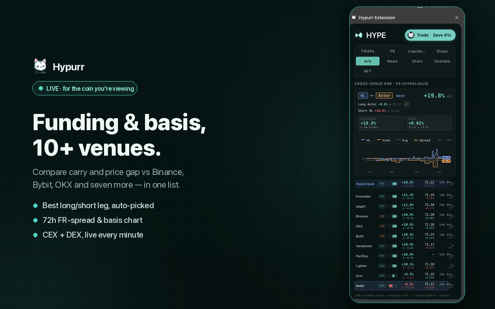
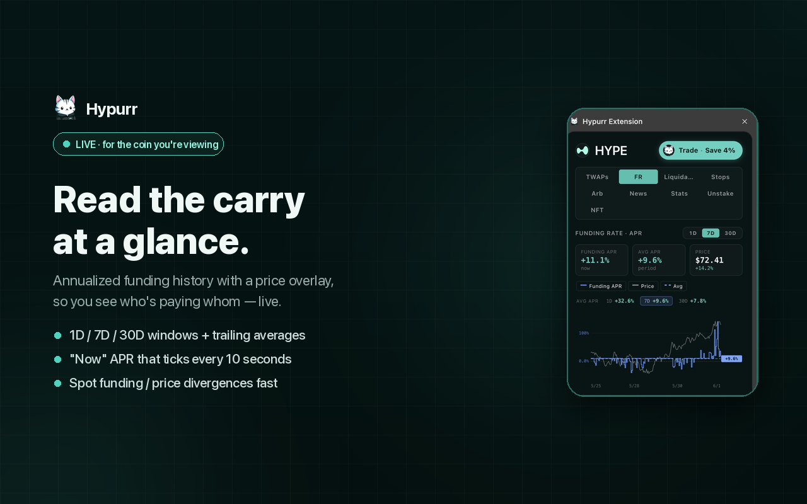
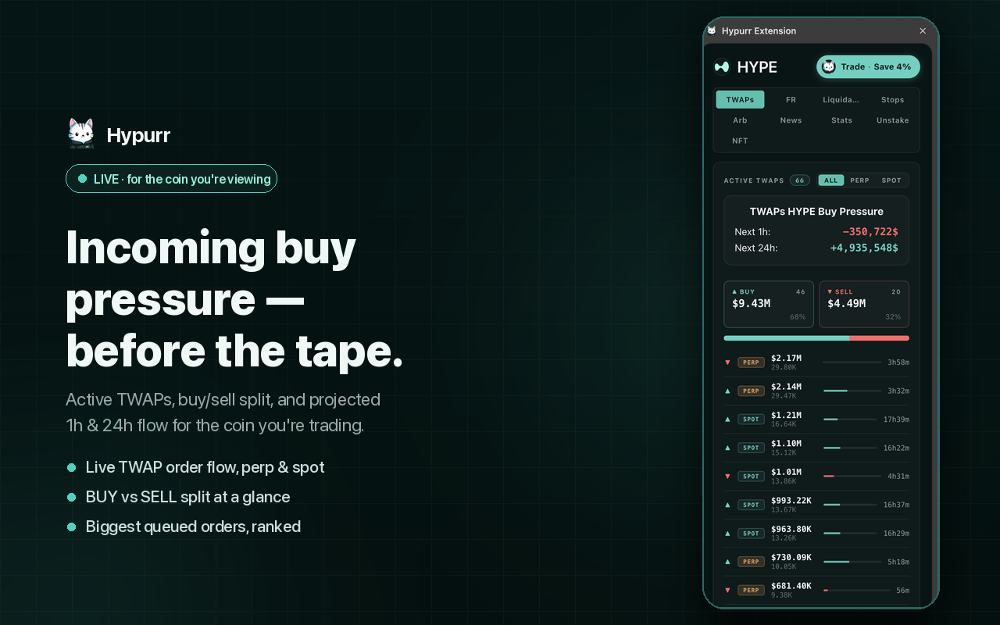
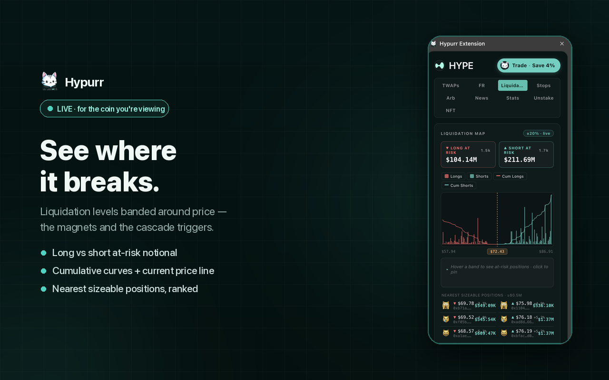
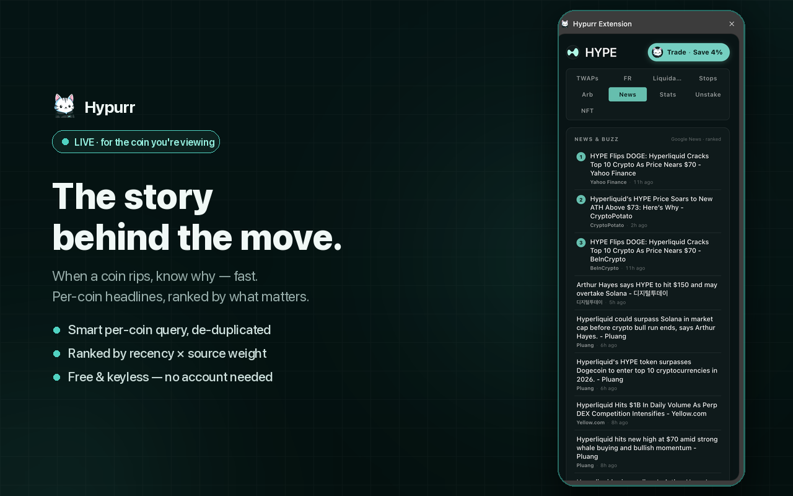

<div align="center">


# Hypurr Extension

### Trade Hyperliquid with a sixth sense.

A Chrome **side panel** that rides along on `app.hyperliquid.xyz` and surfaces the context perp traders actually dig for — funding history, cross-venue basis, liquidation & stop maps, prediction-market odds, news, treasury flows — **all for the exact coin on your screen, live.** No tab-switching. No spreadsheets.

<br/>

[](LICENSE)
[](manifest.json)
[](package.json)
[](tsconfig.json)
[](#-build-your-own-tab-in-3-files)

**[🌐 Website](https://munron.github.io/hyper-extension/)** · **[⚡ Install](#-install-60-seconds)** · **[🧩 Build a tab](#-build-your-own-tab-in-3-files)** · **[🛠 Architecture](#-under-the-hood)**

<br/>




</div>

---

## The problem

A Hyperliquid perp trader keeps a dozen browser tabs and a spreadsheet open just to answer simple questions: *Is funding rich vs Binance right now? Where are the liquidation cascades stacked? Did Strategy just buy more BTC? What does the crowd give for a $70k tag this week?*

Hyperliquid's own UI shows almost none of it.

**Hypurr reads the coin from your active trade tab and pulls all of that into one panel** — and switches with you the instant you change markets. Open `…/trade/BTC`, and the panel is about BTC. Flip to `…/trade/xyz:NVDA`, and a Stocks tab with live overnight ticks appears. It follows you.

```
   app.hyperliquid.xyz/trade/BTC   ─┐
                                    ├──►  🐱  Hypurr reads the coin → rebuilds every tab for it
   …/trade/HYPE   …/trade/xyz:WTI  ─┘
```

---

## ✨ What you get

Each tab only shows up when it's relevant to the coin you're on, so the panel stays uncluttered.

| Tab | What it surfaces | Appears for | Backed by |
| --- | --- | --- | --- |
| **TWAPs** | In-flight TWAP order flow, buy/sell split, projected 1h/24h pressure | any coin | Hyperliquid |
| **FR** | Funding APR history (1D/7D/30D) + trailing averages + price overlay | any perp | Hyperliquid |
| **Liquidation** | Heatmap of nearby liquidation bands + top positions per side | main-DEX coins | Hyperdash |
| **Stops** | Resting stop-loss clusters by price band | main-DEX coins | Hyperdash |
| **Arb** | Funding **&** price basis vs **10 other venues** + 72h spread chart | any perp | 10 perp venues |
| **Predict** 🆕 | Polymarket price-probability **ladder** + catalyst **movers** (24h shifts) | crypto | Polymarket |
| **News** | Per-coin headlines ranked by recency & source quality | any coin | Google News |
| **Events** | Macro / earnings / catalyst calendar scoped to the coin | RWA perps | mixed |
| **Stocks** | TradFi fundamentals, earnings trends, **live overnight tick** | stock perps | Yahoo Finance |
| **MSTR** 🆕 | Strategy's BTC treasury — cost basis, mNAV, P/L, buys **and** sells linked to each SEC 8-K | BTC | StrategyTracker · CoinGecko |
| **Stats** | HL revenue, AF buybacks & burn, HYPE spot-ETF flow | HYPE | DefiLlama · Farside |
| **Unstake** | HYPE unstaking queue & biggest queued unlocks | HYPE | Hypurrscan |
| **NFT** | Hypurr collection floor + volume chart | HYPE | OpenSea |

<div align="center">



</div>

### A few things we're quietly proud of

- **🎯 Cross-venue arb in one glance** — HL funding compared against Binance, Bybit, OKX, Aster, Lighter, Pacifica, Extended, edgeX, Grvt & Variational, with the best dislocation rendered as an actionable long-leg/short-leg spread and a 72h stability chart.
- **🔮 Prediction markets that actually move** — the Predict tab leads with the crowd's *price-probability distribution* and the *biggest 24h shifts*, not a static 50/50 coin-flip. When a probability jumps, something happened.
- **🌙 Live overnight stock prices** — Yahoo's WebSocket streamer is the only public source exposing Blue Ocean ATS overnight ticks; we decode its protobuf frames in ~40 lines, no dependency.
- **🟠 Corporate BTC treasury radar** — the MSTR tab caught Strategy's *first-ever 32 BTC sale* by diffing daily balances, and links every move to its 8-K filing.

---

## ⚡ Install (60 seconds)

Not on the Chrome Web Store yet — load it unpacked:

```bash
git clone https://github.com/munron/hyper-extension.git
cd hyper-extension
npm install
npm run build      # → ./dist
```

Then in Chrome:

1. Open `chrome://extensions/`
2. Toggle **Developer mode** (top-right)
3. **Load unpacked** → select the `dist/` folder
4. Pin Hypurr, open any `app.hyperliquid.xyz/trade/…` page, click the icon

> `npm run dev` runs Vite + CRXJS with HMR for fast iteration.

---

## 🧩 Build your own tab in ~3 files

This is the fun part. A new data source is **one lib file, one component, and one line in the tab registry** — no framework ceremony.

**1. Fetch the data** — `src/lib/myThing.ts`

```ts
export type MyData = { value: number };

export async function fetchMyThing(coin: string): Promise<MyData> {
  const res = await fetch(`https://api.example.com/${coin}`);
  if (!res.ok) throw new Error(`${res.status}`);
  return res.json();
}
```

**2. Render it** — `src/sidepanel/MyPanel.tsx`

```tsx
import { useEffect, useState } from "react";
import { fetchMyThing, type MyData } from "../lib/myThing";

export default function MyPanel({ coin }: { coin: string }) {
  const [data, setData] = useState<MyData | null>(null);
  useEffect(() => { void fetchMyThing(coin).then(setData); }, [coin]);
  return <section className="hs">{data?.value ?? "…"}</section>;
}
```

**3. Register the tab** — in `src/sidepanel/App.tsx`, add to `TABS`:

```ts
// isAvailable decides when the tab appears — gate on coin, category, or DEX.
{ id: "mine", label: "Mine", isAvailable: (c) => c.coin === "BTC" },
```

…then render `{activeTab === "mine" && <MyPanel coin={resolvedCoinId} />}` and, if you hit a new domain, add it to `host_permissions` in [`manifest.json`](manifest.json). That's it — the panel handles tab routing, coin sync, and refresh for you.

> **Good first tabs:** open-interest by venue · borrow/lend rates · whale-wallet flow · a Polymarket sparkline from CLOB `/prices-history` · your own alpha. PRs very welcome.

---

## 🛠 Under the hood

```
src/
  background/        Service worker — keeps the panel wired to the active tab
  content/           Reads the connected wallet / coin off the HL page
  sidepanel/         React UI — one file per tab + App.tsx tab router
  lib/               One hand-rolled client per data source ↓
    hyperliquid.ts     Info API (funding, candles, meta, sub-DEX aware)
    exchanges.ts       10-venue funding aggregator + symbol alias table
    hyperdash.ts       Liquidation & stop bands
    polymarket.ts      Price-probability ladders + catalyst movers
    mstrTreasury.ts    Strategy BTC treasury + purchase/sale timeline
    yahooFinance.ts    quoteSummary + chart (crumb-auth flow)
    yahooStreamer.ts   WebSocket + ~40-line protobuf decoder
    coinMap.ts         Canonical coin index across main + sub-DEX universes
    …news, events, hypeStats, hypeUnstaking, opensea, farsideEtf
```

**Stack:** Vite · React 19 · TypeScript · Chrome MV3 via CRXJS. **Zero runtime deps beyond React** — every API client is hand-written against the upstream endpoint, so the bundle stays small and the data path stays transparent.

<details>
<summary><b>16+ public data sources, zero API keys</b></summary>

| Source | Used for |
| --- | --- |
| Hyperliquid Info API | Funding, candles, meta, sub-DEX universes |
| Hyperdash | Liquidation & stop bands |
| Binance · Bybit · OKX · Aster · Lighter · Pacifica · Extended · edgeX · Grvt · Variational | Per-venue funding & history |
| Polymarket Gamma | Price-probability ladders, catalyst markets |
| StrategyTracker · CoinGecko | MSTR treasury, holdings, cost basis |
| Yahoo Finance REST + WebSocket | Stock fundamentals, earnings, live overnight ticks |
| DefiLlama · Farside | HL revenue, HYPE ETF flow |
| Hypurrscan | HYPE unstaking queue |
| OpenSea GraphQL | Hypurr NFT floor & volume |
| Google News | Per-coin headlines |

No API keys are embedded; everything runs against public endpoints. Where a flow needs auth (Yahoo's crumb cookie), it uses the same dance Yahoo's own web client does.

</details>

<details>
<summary><b>Design notes worth knowing before you hack on it</b></summary>

- **Funding is rendered step-after, always.** Funding is a discrete event (hourly on HL, 8-hourly on most CEXs) held constant between settlements. Linear interpolation implies a drift that never happened — so every funding chart steps.
- **Sub-DEX awareness.** HL splits its universe across a main DEX and builder DEXs (`xyz:`, `flx:`). The coin index pre-fetches every sub-universe; Liquidation/Stops gate on `hasMainPerp`, FR/Arb on `hasPerp`.
- **Explicit symbol aliases, not fuzzy matching.** Cross-venue listings diverge (HL `CL` ↔ Lighter `WTI` ↔ Binance `BZ`). A one-line-per-divergence table in `exchanges.ts` covers the ~15 real cases; native matches need no entry.
- **Trader value over data dumps.** A feature earns its tab only if it tells you something the chart doesn't — sorted by what's *moving*, with the change shown. (We deleted a 50/50 prediction-market widget for failing this bar.)

</details>

---

## 🤝 Contributing

Issues and PRs welcome — whether it's a new data source, a venue alias, or a UX nudge. Pick a [Good first tab](#-build-your-own-tab-in-3-files), open a draft early, and ship.

## ⚠️ Disclaimer

Independent, open-source tool — **not affiliated with Hyperliquid.** Data comes from public APIs and may be delayed or wrong. Nothing here is financial advice; markets are risky and you can lose money.

## 📄 License

[MIT](LICENSE) — fork it, ship it, make it yours.
